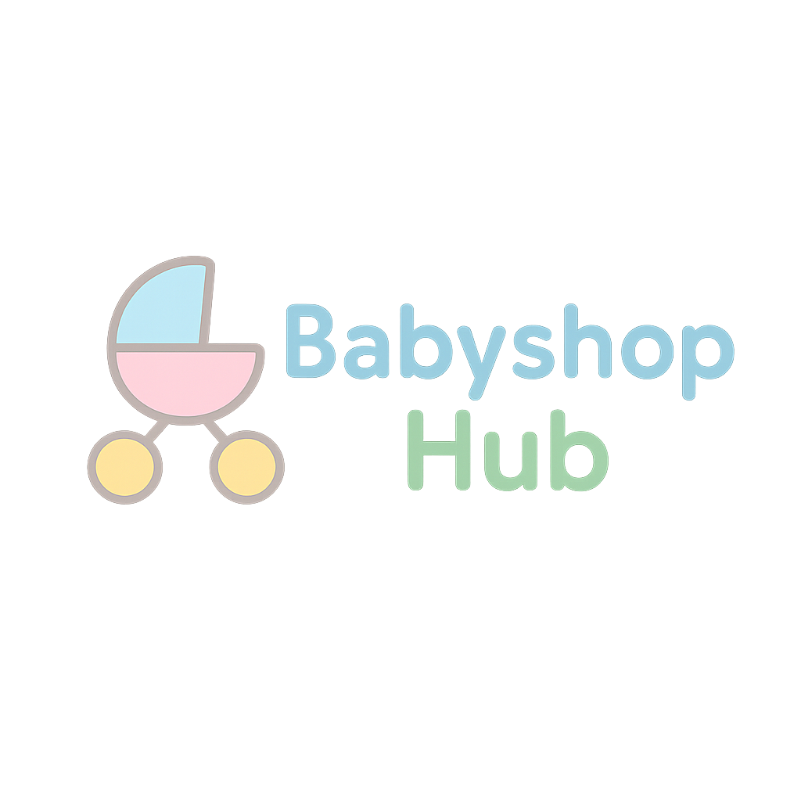
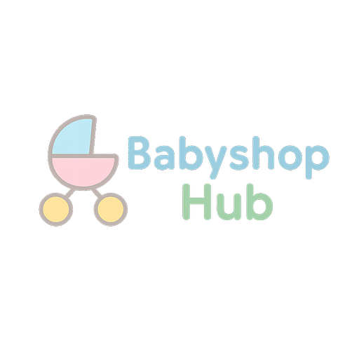
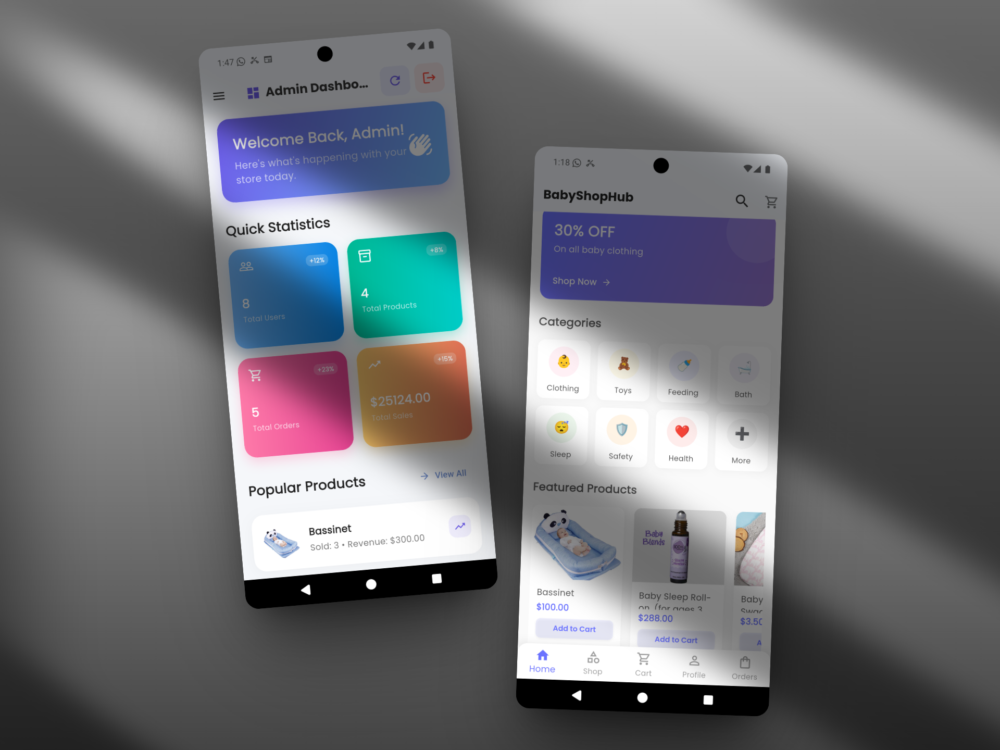
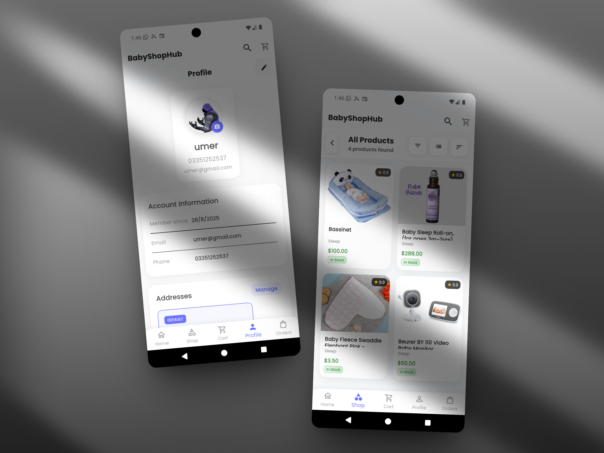
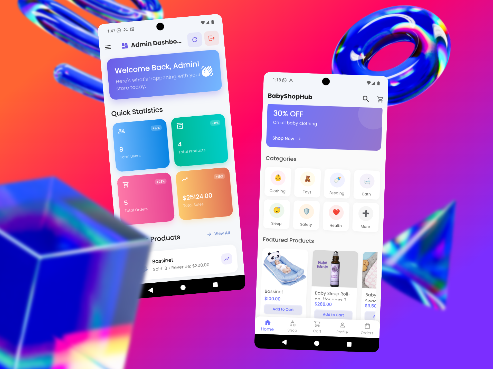

# 🛒 BabyShopHub - Revolutionizing Baby E-Commerce

[](https://flutter.dev/)
[](https://firebase.google.com/)
[](https://github.com/your-repo/baby-shophub/releases)
[](https://opensource.org/licenses/MIT)
[](https://github.com/your-repo/baby-shophub/actions)
[](https://dart.dev/)
[](https://pub.dev/packages/provider)

> **Empowering parents with seamless, secure, and delightful shopping experiences for all baby essentials.**

BabyShopHub is a cutting-edge Flutter-based e-commerce mobile application designed exclusively for baby products. Built with modern architecture, robust Firebase backend, and intuitive user experience, it offers a comprehensive shopping platform that combines security, performance, and ease of use. Whether you're a new parent or a seasoned caregiver, discover everything your little one needs in one beautifully crafted app.



## 🌟 Key Highlights

- **🏆 Award-Winning Design**: Sleek Material Design with smooth animations and responsive layouts
- **🔒 Enterprise-Grade Security**: Firebase Authentication with secure data handling
- **⚡ High Performance**: Optimized with Provider state management and image caching
- **📱 Cross-Platform**: Seamless experience on iOS and Android
- **🛡️ Admin Panel**: Comprehensive management tools for store owners
- **🌐 Real-Time Updates**: Live order tracking and notifications
- **💳 Secure Payments**: Integrated payment processing (expandable)
- **📊 Analytics**: Built-in insights for business intelligence

## 📱 Features

### 🔐 Authentication & User Management
- **Secure Registration & Login**: Firebase-powered authentication
- **Password Recovery**: Hassle-free account recovery
- **Profile Management**: Edit personal details and preferences
- **Address Book**: Multiple delivery addresses
- **Notification Settings**: Customizable push notifications

### 🛍️ Shopping Experience
- **Product Categories**: Diapers, Baby Food, Clothing, Toys, Health & Safety, Feeding, Nursery, Bathing, Strollers & Carriers, Gifts
- **Advanced Search**: Filter by price, brand, rating, and more
- **Featured Products**: Curated selections of trending items
- **Wishlist**: Save favorite products for later
- **Shopping Cart**: Persistent cart with quantity management
- **Order History**: Complete order tracking with status updates
- **Reviews & Ratings**: User-generated feedback system

### 🎨 User Interface & Experience
- **Modern Material Design**: Consistent with latest Android/iOS guidelines
- **Responsive Layout**: Optimized for all screen sizes
- **Smooth Animations**: Fluid transitions and micro-interactions
- **Dark Mode Support**: Eye-friendly shopping experience
- **Accessibility**: Screen reader support and high contrast options
- **Offline Mode**: Basic functionality without internet

### 🔧 Technical Features
- **State Management**: Provider pattern for efficient state handling
- **Image Optimization**: Cached Network Image for fast loading
- **Local Storage**: Shared Preferences for offline data
- **Firebase Integration**:
  - Firebase Auth for secure authentication
  - Cloud Firestore for real-time database
  - Firebase Storage for media assets
  - Firebase Messaging for push notifications
- **Error Handling**: Comprehensive error states and retry mechanisms
- **Connectivity**: Offline detection and sync capabilities

### 👨‍💼 Admin Panel
- **Dashboard Analytics**: Sales, users, and product insights
- **Product Management**: Add, edit, and remove products
- **Order Processing**: Manage orders and update statuses
- **User Management**: View and manage user accounts
- **Category Management**: Organize products efficiently
- **Reports**: Generate sales and performance reports

## 🚀 Installation & Setup

### Prerequisites
- **Flutter SDK**: Version 3.8.1 or higher
- **Dart SDK**: Included with Flutter
- **Firebase Account**: For backend services
- **Android Studio/XCode**: For mobile development and testing
- **Git**: For version control

### Quick Start
1. **Clone the Repository**
   ```bash
   git clone https://github.com/your-username/baby-shophub.git
   cd baby-shophub
   ```

2. **Install Dependencies**
   ```bash
   flutter pub get
   ```

3. **Firebase Configuration**
   - Create a new Firebase project at [Firebase Console](https://console.firebase.google.com/)
   - Enable Authentication, Firestore, and Storage services
   - Download `google-services.json` and place it in `android/app/`
   - Update Firebase security rules for your needs

4. **Environment Setup**
   Create a `.env` file in the root directory:
   ```env
   FIREBASE_API_KEY=your_api_key_here
   FIREBASE_PROJECT_ID=your_project_id_here
   FIREBASE_MESSAGING_SENDER_ID=your_sender_id_here
   ```

5. **Run the Application**
   ```bash
   flutter run
   ```

### Build for Production
```bash
# Android APK
flutter build apk --release

# iOS (on macOS)
flutter build ios --release
```

## 📖 Usage

### For Users
```dart
// Example: Adding product to cart
final cartProvider = Provider.of<CartProvider>(context, listen: false);
await cartProvider.addToCart(product, quantity: 1);
```

### For Developers
- Follow Flutter's [style guide](https://flutter.dev/docs/development/tools/formatting)
- Use meaningful commit messages
- Write unit and widget tests
- Document new features and APIs

### API Integration Example
```dart
// Firebase Firestore integration
final productService = ProductService();
final products = await productService.getProductsByCategory('diapers');
```

## 📊 Project Structure

```
baby_shophub/
├── lib/
│   ├── models/              # Data models (User, Product, Cart, Order)
│   ├── providers/           # State management with Provider
│   ├── screens/             # UI screens and pages
│   │   ├── auth/           # Authentication flows
│   │   ├── admin/          # Admin panel screens
│   │   └── ...             # Other app screens
│   ├── services/           # Firebase and external services
│   ├── theme/              # App theming and styling
│   ├── utils/              # Utilities, constants, helpers
│   ├── widgets/            # Reusable UI components
│   └── main.dart           # App entry point
├── assets/
│   └── images/             # Static assets
├── android/                # Android-specific configuration
├── ios/                    # iOS-specific configuration
└── test/                   # Unit and integration tests
```

## 🛠️ Technologies & Dependencies

### Core Framework
- **Flutter**: Cross-platform UI framework
- **Dart**: Programming language

### Backend & Services
- **Firebase Core**: Platform integration
- **Firebase Auth**: User authentication
- **Cloud Firestore**: NoSQL database
- **Firebase Storage**: File storage
- **Firebase Messaging**: Push notifications

### State Management
- **Provider**: Dependency injection and state management

### UI & UX
- **Material Design**: Google's design system
- **Cupertino Icons**: iOS-style icons
- **Google Fonts**: Typography
- **Shimmer**: Loading animations
- **Badges**: Notification indicators

### Utilities
- **Shared Preferences**: Local storage
- **Cached Network Image**: Image caching
- **Image Picker**: Media selection
- **URL Launcher**: External links
- **Connectivity Plus**: Network status
- **Intl**: Internationalization

## 📸 Screenshots & Media

<!-- ### App Store Assets
| App Store | Play Store | Screenshot |
|-----------|------------|------------|
|  |  |  | -->

### App Screenshots
| Home Screen/Admin Screen | Product Details/Profile Screen | Shopping Cart | User Profile |
|-------------|----------------|---------------|--------------|
|  |  |  |  |

### Demo GIF


*Note: Replace placeholder images with actual app screenshots for production*

## 🔧 Configuration

### Firebase Setup
1. Create project at [Firebase Console](https://console.firebase.google.com/)
2. Enable required services (Auth, Firestore, Storage, Messaging)
3. Configure security rules:
   ```javascript
   // Firestore Rules Example
   rules_version = '2';
   service cloud.firestore {
     match /databases/{database}/documents {
       match /{document=**} {
         allow read, write: if request.auth != null;
       }
     }
   }
   ```

### Environment Variables
```env
# Required
FIREBASE_API_KEY=your_api_key
FIREBASE_PROJECT_ID=your_project_id
FIREBASE_APP_ID=your_app_id

# Optional
ENABLE_ANALYTICS=true
LOG_LEVEL=debug
```

## 📚 API Documentation

### Firebase Integration
- **Authentication API**: [Firebase Auth Docs](https://firebase.google.com/docs/auth)
- **Database API**: [Firestore Docs](https://firebase.google.com/docs/firestore)
- **Storage API**: [Firebase Storage Docs](https://firebase.google.com/docs/storage)

### Key Service Classes
```dart
// Product Service
class ProductService {
  Future<List<Product>> getProducts();
  Future<Product> getProductById(String id);
  Future<void> addProduct(Product product);
}

// Cart Service
class CartService {
  Future<Cart> getCart(String userId);
  Future<void> addToCart(String userId, CartItem item);
}
```

## ❓ FAQ

### General
**Q: Is the app free to use?**  
A: Yes, the app is free to download and use for shopping.

**Q: What payment methods are supported?**  
A: Currently supports cash on delivery. Payment gateway integration coming soon.

### Technical
**Q: Does it work offline?**  
A: Basic features work offline, but online connection is required for purchases.

**Q: How do I report a bug?**  
A: Use GitHub Issues or contact support.

### Development
**Q: How can I contribute?**  
A: See the Contributing section below.

**Q: What Flutter version is required?**  
A: Flutter 3.8.1 or higher.

## 🗺️ Roadmap

### Version 1.1.0 (Q2 2024)
- [ ] Payment gateway integration
- [ ] Advanced search filters
- [ ] Wishlist sharing
- [ ] Order cancellation

### Version 1.2.0 (Q3 2024)
- [ ] Multi-language support
- [ ] Dark mode toggle
- [ ] Push notification preferences
- [ ] Product comparison feature

### Version 2.0.0 (Q4 2024)
- [ ] Web platform support
- [ ] Advanced analytics dashboard
- [ ] AI-powered recommendations
- [ ] Social features

### Future Enhancements
- [ ] AR product visualization
- [ ] Voice search
- [ ] Subscription services
- [ ] Partner integrations

## 🤝 Contributing

We welcome contributions from the community! Here's how you can help:

### Development Process
1. **Fork** the repository
2. **Create** a feature branch: `git checkout -b feature/amazing-feature`
3. **Commit** your changes: `git commit -m 'Add amazing feature'`
4. **Push** to the branch: `git push origin feature/amazing-feature`
5. **Open** a Pull Request

### Guidelines
- Follow Flutter's [effective Dart](https://dart.dev/guides/language/effective-dart) guidelines
- Write clear, concise commit messages
- Add tests for new features
- Update documentation as needed
- Ensure code passes all lint checks

### Code of Conduct
Please read our [Code of Conduct](CODE_OF_CONDUCT.md) before contributing.

## 📝 License

This project is licensed under the MIT License - see the [LICENSE](LICENSE) file for details.

```
MIT License

Copyright (c) 2024 BabyShopHub

Permission is hereby granted, free of charge, to any person obtaining a copy
of this software and associated documentation files (the "Software"), to deal
in the Software without restriction, including without limitation the rights
to use, copy, modify, merge, publish, distribute, sublicense, and/or sell
copies of the Software, and to permit persons to whom the Software is
furnished to do so, subject to the following conditions:

The above copyright notice and this permission notice shall be included in all
copies or substantial portions of the Software.
```

## 🙏 Acknowledgments

### Core Team
- **Lead Developer**: [Your Name]
- **UI/UX Designer**: [Designer Name]
- **Project Manager**: [PM Name]

### Technologies & Libraries
- **Flutter Team**: For the incredible framework
- **Firebase Team**: For robust backend services
- **Provider Contributors**: For excellent state management
- **Open Source Community**: For countless helpful packages

### Special Thanks
- Beta testers and early adopters
- Contributors and maintainers
- The Flutter and Dart communities
- Parents and caregivers who provided valuable feedback

## 📞 Support & Contact

### Getting Help
- 📧 **Email**: support@babyshophub.com
- 🐛 **Bug Reports**: [GitHub Issues](https://github.com/your-repo/baby-shophub/issues)
- 💬 **Discussions**: [GitHub Discussions](https://github.com/your-repo/baby-shophub/discussions)
- 📖 **Documentation**: [Wiki](https://github.com/your-repo/baby-shophub/wiki)

### Community
- 🌟 **Star** the repository if you find it useful
- 🔄 **Fork** and contribute back
- 📢 **Share** with fellow developers
- 💡 **Suggest** new features

---

## 🏆 Awards & Recognition

*This project has been recognized for excellence in mobile app development and user experience design.*

**Tags**: `flutter` `dart` `firebase` `ecommerce` `baby-products` `mobile-app` `shopping-app` `provider` `material-design` `cross-platform` `firebase-auth` `cloud-firestore` `state-management` `responsive-design` `user-experience`

---

*Made with ❤️ for parents, by developers who care about quality and user experience.*
