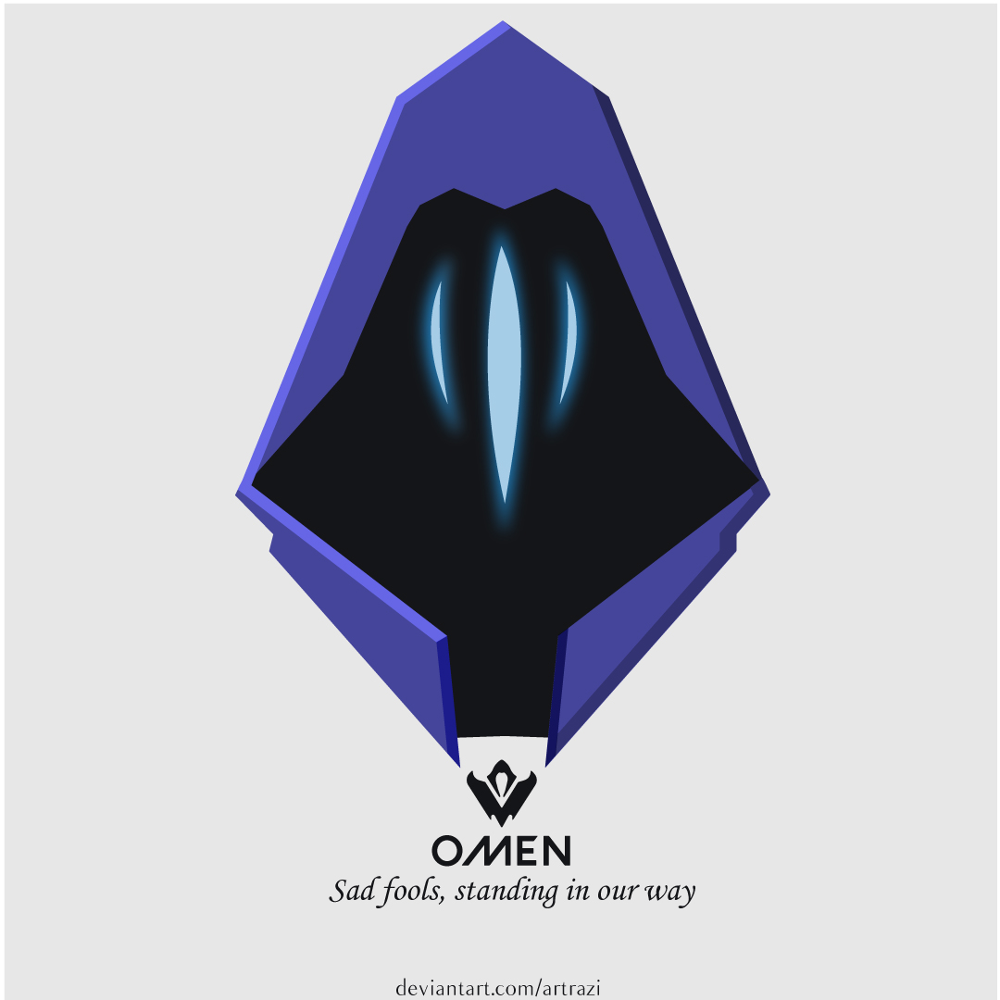

# 🛒 BabyShopHub - Baby Products E-Commerce App


A beautiful and feature-rich Flutter e-commerce application specializing in baby products. Built with modern Flutter practices and Firebase backend.

## 📱 Features

### 🔐 Authentication
- User Registration & Login
- Password Recovery
- Secure Firebase Authentication
- User Profile Management

### 🛍️ Shopping Experience
- **Product Categories**: Diapers, Baby Food, Clothing, Toys, Health & Safety, Feeding, Nursery, Bathing, Strollers & Carriers, Gifts
- **Featured Products**: Curated selection of popular items
- **Product Search**: Easy product discovery
- **Shopping Cart**: Add/remove items with quantity management
- **Order Management**: Track orders with status (Pending, Confirmed, Processing, Shipped, Delivered, Cancelled)

### 🎨 User Interface
- Modern Material Design
- Responsive Layout
- Smooth Animations
- Bottom Navigation Bar
- Promotional Banners
- Category Grid View
- Product Cards with Images

### 🔧 Technical Features
- **State Management**: Provider pattern for efficient state handling
- **Image Caching**: Optimized image loading with cached_network_image
- **Local Storage**: Shared Preferences for persistent data
- **Firebase Integration**: 
  - Firebase Auth for authentication
  - Cloud Firestore for database
  - Firebase Storage for images
- **Error Handling**: Comprehensive error states and loading indicators

## 🚀 Installation

### Prerequisites
- Flutter SDK (3.8.1 or higher)
- Dart SDK
- Firebase project setup
- Android Studio/Xcode (for mobile development)

### Steps
1. **Clone the repository**
   ```bash
   git clone <your-repo-url>
   cd baby_shophub
   ```

2. **Install dependencies**
   ```bash
   flutter pub get
   ```

3. **Firebase Setup**
   - Create a Firebase project
   - Enable Authentication, Firestore, and Storage
   - Download `google-services.json` and place it in `android/app/`
   - Configure Firebase in your project

4. **Run the application**
   ```bash
   flutter run
   ```

## 📁 Project Structure

```
baby_shophub/
├── lib/
│   ├── models/          # Data models (User, Product, Cart, Order, etc.)
│   ├── providers/       # State management providers
│   ├── screens/         # UI screens
│   │   ├── auth/        # Authentication screens
│   │   └── home/        # Main app screens
│   ├── services/        # Firebase services
│   ├── theme/          # App theme configuration
│   ├── utils/          # Utilities and constants
│   └── widgets/        # Reusable widgets
├── assets/
│   └── images/         # App images and assets
└── android/            # Android specific files
```

## 🛠️ Technologies Used

- **Frontend**: Flutter, Dart
- **Backend**: Firebase (Auth, Firestore, Storage)
- **State Management**: Provider
- **Image Handling**: Cached Network Image
- **Local Storage**: Shared Preferences
- **UI Components**: Material Design, Cupertino Icons, Google Fonts
- **Utilities**: Intl, Badges, Shimmer, Image Picker

## 📸 Screenshots

| Home Screen | Product List | Cart | Profile |
|-------------|-------------|------|---------|
|  |  |  |  |

*Note: Replace placeholder images with actual app screenshots*

## 🔧 Configuration

### Firebase Setup
1. Create a new Firebase project
2. Enable Authentication, Firestore, and Storage
3. Add your app to the project
4. Download configuration files
5. Update Firebase rules for security

### Environment Variables
Create a `.env` file for configuration:
```
FIREBASE_API_KEY=your_api_key
FIREBASE_PROJECT_ID=your_project_id
```

## 📦 Dependencies

Key dependencies used in this project:

```yaml
dependencies:
  flutter:
    sdk: flutter
  firebase_core: ^4.0.0
  firebase_auth: ^6.0.1
  cloud_firestore: ^6.0.0
  firebase_storage: ^13.0.0
  provider: ^6.1.5+1
  cached_network_image: ^3.4.1
  shared_preferences: ^2.5.3
  google_fonts: ^6.3.0
  # ... and more
```

## 🎯 Usage

### For Developers
- Follow the Flutter style guide
- Use meaningful commit messages
- Write tests for new features
- Document your code

### For Users
- Create an account or login
- Browse products by category
- Add items to cart
- Complete checkout process
- Track your orders

## 🤝 Contributing

We welcome contributions! Please follow these steps:

1. Fork the project
2. Create a feature branch (`git checkout -b feature/amazing-feature`)
3. Commit your changes (`git commit -m 'Add amazing feature'`)
4. Push to the branch (`git push origin feature/amazing-feature`)
5. Open a Pull Request

## 📝 License

This project is licensed under the MIT License - see the [LICENSE](LICENSE) file for details.

## 🙏 Acknowledgments

- Flutter team for the amazing framework
- Firebase for backend services
- Provider package for state management
- All contributors and testers

## 📞 Support

If you have any questions or need help, please:
- Open an issue on GitHub
- Check the documentation
- Contact the development team

---

**Tags**: `flutter` `dart` `firebase` `ecommerce` `baby-products` `mobile-app` `shopping-app` `provider` `material-design`
