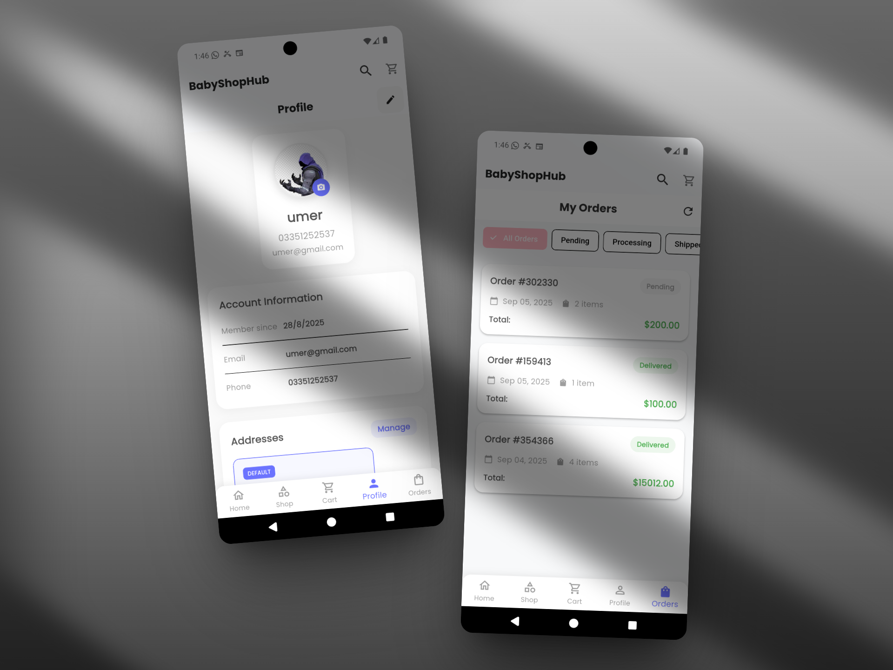

# 🛒 BabyShopHub - Revolutionizing Baby E-Commerce

[](https://flutter.dev/)
[](https://firebase.google.com/)
[](https://github.com/your-repo/baby-shophub/releases)
[](https://opensource.org/licenses/MIT)
[](https://github.com/your-repo/baby-shophub/actions)
[](https://dart.dev/)
[](https://pub.dev/packages/provider)

> **Empowering parents with seamless, secure, and delightful shopping experiences for all baby essentials.**

BabyShopHub is a cutting-edge Flutter-based e-commerce mobile application designed exclusively for baby products. Built with modern architecture, robust Firebase backend, and intuitive user experience, it offers a comprehensive shopping platform that combines security, performance, and ease of use. Whether you're a new parent or a seasoned caregiver, discover everything your little one needs in one beautifully crafted app.


## 📚 Table of Contents

- [🌟 Key Highlights](#-key-highlights)
- [📱 Features](#-features)
- [🚀 Installation & Setup](#-installation--setup)
  - [Prerequisites](#prerequisites)
  - [IDE Setup](#ide-setup)
  - [Firebase Configuration (Detailed)](#firebase-configuration-detailed)
  - [Quick Start](#quick-start)
  - [Build for Production](#build-for-production)
- [📖 Usage](#-usage)
- [📊 Project Structure](#-project-structure)
- [🛠️ Technologies & Dependencies](#️-technologies--dependencies)
- [📸 Screenshots & Media](#-screenshots--media)
- [🧩 Headless Commerce Backends (Medusa/Vendure)](#-headless-commerce-backends-medusavendure)
- [🔧 Configuration](#-configuration)
- [📚 API Documentation](#-api-documentation)
- [❓ FAQ](#-faq)
- [🗺️ Roadmap](#️-roadmap)
- [🤝 Contributing](#-contributing)
- [📝 License](#-license)
- [🙏 Acknowledgments](#-acknowledgments)
- [📞 Support & Contact](#-support--contact)
- [🏆 Awards & Recognition](#-awards--recognition)

## 🌟 Key Highlights

- **🏆 Award-Winning Design**: Sleek Material Design with smooth animations and responsive layouts
- **🔒 Enterprise-Grade Security**: Firebase Authentication with secure data handling
- **⚡ High Performance**: Optimized with Provider state management and image caching
- **📱 Cross-Platform**: Seamless experience on iOS and Android
- **🛡️ Admin Panel**: Comprehensive management tools for store owners
- **🌐 Real-Time Updates**: Live order tracking and notifications
- **💳 Secure Payments**: Integrated payment processing (expandable)
- **📊 Analytics**: Built-in insights for business intelligence

## 📱 Features

### 🔐 Authentication & User Management
- **Secure Registration & Login**: Firebase-powered authentication
- **Password Recovery**: Hassle-free account recovery
- **Profile Management**: Edit personal details and preferences
- **Address Book**: Multiple delivery addresses
- **Notification Settings**: Customizable push notifications

### 🛍️ Shopping Experience
- **Product Categories**: Diapers, Baby Food, Clothing, Toys, Health & Safety, Feeding, Nursery, Bathing, Strollers & Carriers, Gifts
- **Advanced Search**: Filter by price, brand, rating, and more
- **Featured Products**: Curated selections of trending items
- **Wishlist**: Save favorite products for later
- **Shopping Cart**: Persistent cart with quantity management
- **Order History**: Complete order tracking with status updates
- **Reviews & Ratings**: User-generated feedback system

### 🎨 User Interface & Experience
- **Modern Material Design**: Consistent with latest Android/iOS guidelines
- **Responsive Layout**: Optimized for all screen sizes
- **Smooth Animations**: Fluid transitions and micro-interactions
- **Dark Mode Support**: Eye-friendly shopping experience
- **Accessibility**: Screen reader support and high contrast options
- **Offline Mode**: Basic functionality without internet

### 🔧 Technical Features
- **State Management**: Provider pattern for efficient state handling
- **Image Optimization**: Cached Network Image for fast loading
- **Local Storage**: Shared Preferences for offline data
- **Firebase Integration**:
  - Firebase Auth for secure authentication
  - Cloud Firestore for real-time database
  - Firebase Storage for media assets
  - Firebase Messaging for push notifications
- **Error Handling**: Comprehensive error states and retry mechanisms
- **Connectivity**: Offline detection and sync capabilities

### 👨‍💼 Admin Panel
- **Dashboard Analytics**: Sales, users, and product insights with real-time charts
- **Enhanced Product Management**: Advanced product CRUD operations with bulk actions
- **Advanced Analytics**: Detailed business intelligence with custom metrics
- **Order Processing**: Manage orders and update statuses with tracking
- **User Management**: View and manage user accounts with role-based access
- **Category Management**: Organize products efficiently with drag-and-drop
- **Reports**: Generate comprehensive sales and performance reports
- **Data Export/Import**: Bulk data operations with CSV support
- **Admin Settings**: System configuration and preferences
- **Notification Management**: Push notification campaigns and templates
- **Order Tracking**: Real-time order status updates and logistics
- **Payment Management**: Payment processing and transaction history
- **Reviews Analytics**: Customer feedback analysis and moderation
- **Notification Settings**: Granular notification preferences

## 🚀 Installation & Setup

This guide will walk you through setting up the BabyShopHub project on your local machine.

### Prerequisites
Ensure you have the following installed:
- **Flutter SDK**: Version 3.8.1 or higher. ([Installation Guide](https://flutter.dev/docs/get-started/install))
- **Dart SDK**: Included with Flutter.
- **Firebase Account**: A Google account to create and manage Firebase projects. ([Firebase Console](https://console.firebase.google.com/))
- **IDE**:
    - **Android Studio**: Recommended for Flutter development. ([Download](https://developer.android.com/studio))
    - **Visual Studio Code**: A popular alternative. ([Download](https://code.visualstudio.com/))
- **Git**: For cloning the repository. ([Installation Guide](https://git-scm.com/book/en/v2/Getting-Started-Installing-Git))
- **Xcode**: (For macOS users) For iOS development and testing. ([Mac App Store](https://apps.apple.com/us/app/xcode/id497799835))
- **CocoaPods**: (For macOS users) For managing iOS dependencies. `sudo gem install cocoapods`

### IDE Setup
1.  **Install Flutter and Dart Plugins**:
    *   **Android Studio**: Go to `File > Settings > Plugins` (or `Android Studio > Preferences > Plugins` on macOS), search for "Flutter", and install. This will also prompt you to install the Dart plugin.
    *   **VS Code**: Go to the Extensions view (Ctrl+Shift+X or Cmd+Shift+X), search for "Flutter", and install the extension by Dart Code.
2.  **Configure Flutter SDK Path**: Ensure your IDE knows where your Flutter SDK is located. This is usually configured during plugin setup.
3.  **Verify Setup**: Run `flutter doctor` in your terminal. This command checks your environment and displays a report of the status of your Flutter installation. Address any issues it reports.

### Firebase Configuration (Detailed)

1.  **Create a Firebase Project**:
    *   Go to the [Firebase Console](https://console.firebase.google.com/).
    *   Click on "**Add project**".
    *   Enter your desired project name (e.g., "BabyShopHubDev").
    *   Follow the on-screen instructions to create the project. You can choose to enable or disable Google Analytics.

2.  **Register Your App with Firebase**:
    *   In your Firebase project dashboard, click the "**Add app**" icon and select the platform(s) you want to support (iOS and/or Android).

    *   **For Android**:
        *   **Package Name**: Find this in `android/app/build.gradle` (look for `applicationId`). It's usually something like `com.example.babyshophub`.
        *   **App Nickname (Optional)**: e.g., "BabyShopHub Android"
        *   **SHA-1 Certificate (Required for Google Sign-In, Phone Auth, etc.)**:
            *   Open your project in Android Studio.
            *   Open the Gradle tab (usually on the right).
            *   Navigate to `YourProjectName > app > Tasks > android > signingReport`. Double-click it.
            *   Copy the SHA-1 value for the `debug` variant.
        *   Click "**Register app**".
        *   **Download `google-services.json`**: Place this file in the `android/app/` directory of your Flutter project.
        *   **Add Firebase SDK**: The console will provide instructions on modifying your `build.gradle` files. FlutterFire usually handles this automatically if you use the FlutterFire CLI, but it's good to verify.
            *   Ensure `classpath 'com.google.gms:google-services:VERSION'` is in `android/build.gradle`.
            *   Ensure `apply plugin: 'com.google.gms.google-services'` is in `android/app/build.gradle`.

    *   **For iOS**:
        *   **Bundle ID**: Find this in Xcode. Open `ios/Runner.xcworkspace`, select Runner in the project navigator, go to the "General" tab, and find "Bundle Identifier". It's usually something like `com.example.babyshophub`.
        *   **App Nickname (Optional)**: e.g., "BabyShopHub iOS"
        *   **App Store ID (Optional)**
        *   Click "**Register app**".
        *   **Download `GoogleService-Info.plist`**: Place this file in the `ios/Runner/` directory of your Flutter project (use Xcode to add this file to the Runner target).
        *   **Firebase SDK via CocoaPods**: Ensure your `ios/Podfile` includes the necessary Firebase pods. FlutterFire often handles this.
        *   **Initialization Code**: Add the initialization code to your `ios/Runner/AppDelegate.swift` (or `AppDelegate.m` if using Objective-C) as instructed by Firebase, if not already handled by FlutterFire.
            ```swift
            // In AppDelegate.swift
            import Firebase
            
            override func application(_ application: UIApplication,
                                didFinishLaunchingWithOptions launchOptions: [UIApplication.LaunchOptionsKey: Any]?) -> Bool {
              FirebaseApp.configure() // Add this line
              GeneratedPluginRegistrant.register(with: self)
              return super.application(application, didFinishLaunchingWithOptions: launchOptions)
            }
            ```

3.  **Enable Firebase Services**:
    *   In the Firebase console, navigate to the "Build" section in the left sidebar.
    *   **Authentication**: Click on "Authentication", then "Get started". Enable the sign-in methods you need (e.g., Email/Password, Google).
    *   **Firestore Database**: Click on "Firestore Database", then "Create database".
        *   Start in **test mode** for development (allows open access). **Remember to secure your rules before production!**
        *   Choose a Firestore location.
    *   **Storage**: Click on "Storage", then "Get started". Follow the prompts to set up Cloud Storage. Set up security rules (similar to Firestore, start with test rules).
    *   **Messaging (FCM)**: (Optional, if using push notifications) No specific "enable" button, but ensure your app is correctly registered.

4.  **Security Rules (Important!)**:
    *   For Firestore and Storage, the default rules in test mode are insecure for production.
    *   Review and update your security rules to protect user data. Example Firestore rules for authenticated users:
      ```javascript
      rules_version = '2';
      service cloud.firestore {
        match /databases/{database}/documents {
          // Allow read/write access to authenticated users
          match /{document=**} {
            allow read, write: if request.auth != null;
          }
        }
      }
      ```
    *   Refer to the "Configuration" section below for more details on production security rules.

### Quick Start

1.  **Clone the Repository**:
    ```bash
    git clone https://github.com/your-username/baby-shophub.git
    cd baby-shophub
    ```
    *(Replace `your-username` with the actual repository URL)*

2.  **FlutterFire Configuration (Recommended)**:
    For easier Firebase setup, especially for multiple environments, consider using the FlutterFire CLI.
    *   Install Firebase CLI: `npm install -g firebase-tools` (or follow [official guide](https://firebase.google.com/docs/cli#install_the_firebase_cli))
    *   Login to Firebase: `firebase login`
    *   Install FlutterFire CLI: `dart pub global activate flutterfire_cli`
    *   Configure your project: `flutterfire configure`
        *   This command will help you link your Flutter app to your Firebase project and automatically download/update configuration files (`google-services.json` and `GoogleService-Info.plist`).

3.  **Install Dependencies**:
    This command fetches all the packages listed in `pubspec.yaml`.
    ```bash
    flutter pub get
    ```
    *If using iOS, also run:*
    ```bash
    cd ios
    pod install
    cd ..
    ```

4.  **Environment Setup (`.env` file)**:
    *   Create a `.env` file in the root directory of the project.
    *   Add your Firebase project-specific API keys and other configuration details. **Note:** These are typically client-side keys and are safe to include in your app. The critical configuration is handled by `google-services.json` and `GoogleService-Info.plist`. The `.env` file might be used for other API keys or for FlutterFire initialization if you choose manual setup.
    ```env
    # Example .env content (values from your Firebase project settings)
    FIREBASE_API_KEY=your_api_key_here 
    FIREBASE_PROJECT_ID=your_project_id_here
    FIREBASE_MESSAGING_SENDER_ID=your_sender_id_here
    FIREBASE_APP_ID_ANDROID=your_android_app_id_here 
    FIREBASE_APP_ID_IOS=your_ios_app_id_here
    ```
    *Ensure your `main.dart` or a similar initialization file loads these environment variables and initializes Firebase correctly, for example using `flutter_dotenv` package.*

5.  **Run the Application**:
    *   Ensure an emulator is running or a device is connected.
    *   You can select the target device in your IDE.
    ```bash
    flutter run
    ```
    *To run on a specific device, use `flutter run -d <deviceId>`.*

### Build for Production
```bash
# Android APK (App Bundle is recommended for Play Store)
flutter build apk --release
flutter build appbundle --release

# iOS (on macOS)
flutter build ios --release
```

### GitHub Actions for APK Releases
To automate APK builds and releases, set up GitHub Actions:

1. **Create Workflow File**: Create `.github/workflows/build-apk.yml` in your repository root:

```yaml
name: Build and Release APK

on:
  push:
    tags:
      - 'v*.*.*'  # Trigger on version tags like v1.0.0
  workflow_dispatch:  # Allow manual trigger

jobs:
  build:
    runs-on: ubuntu-latest

    steps:
    - name: Checkout code
      uses: actions/checkout@v4

    - name: Setup Flutter
      uses: subosito/flutter-action@v2
      with:
        flutter-version: '3.8.1'

    - name: Setup Java
      uses: actions/setup-java@v3
      with:
        java-version: '11'
        distribution: 'temurin'

    - name: Get dependencies
      run: flutter pub get

    - name: Build APK
      run: flutter build apk --release

    - name: Create Release
      uses: softprops/action-gh-release@v1
      if: startsWith(github.ref, 'refs/tags/')
      with:
        files: build/app/outputs/flutter-apk/app-release.apk
        generate_release_notes: true
      env:
        GITHUB_TOKEN: ${{ secrets.GITHUB_TOKEN }}
```

2. **Configure Signing (Optional but Recommended)**:
   - For production builds, configure code signing
   - Add keystore file to repository secrets
   - Update build.gradle.kts with signing config

3. **Trigger the Workflow**:
   - Push a version tag: `git tag v1.0.0 && git push origin v1.0.0`
   - Or trigger manually from GitHub Actions tab

*Ensure you have set up appropriate signing configurations for release builds.*

## 📖 Usage

### For Users
```dart
// Example: Adding product to cart (assuming CartProvider is set up)
// final cartProvider = Provider.of<CartProvider>(context, listen: false);
// await cartProvider.addToCart(product, quantity: 1);
```

### For Admins
- Access admin panel through login screen
- Use dashboard for real-time analytics and insights
- Manage products with enhanced CRUD operations
- Process orders and update tracking status
- Export data in CSV format for reporting
- Configure system settings and notifications

### For Developers
- Follow Flutter's [style guide](https://flutter.dev/docs/development/tools/formatting) and [Effective Dart](https://dart.dev/guides/language/effective-dart) guidelines.
- Use meaningful commit messages.
- Write unit, widget, and integration tests.
- Document new features and APIs.

### API Integration Example
```dart
// Firebase Firestore integration (assuming ProductService is implemented)
// final productService = ProductService();
// final products = await productService.getProductsByCategory('diapers');

// Admin service example
// final adminService = AdminService();
// final stats = await adminService.getDashboardStats();
```

## 📊 Project Structure

```
baby_shophub/
├── .env                   # Environment variables (gitignored)
├── android/               # Android-specific configuration
│   └── app/
│       └── google-services.json # Firebase config for Android
├── ios/                   # iOS-specific configuration
│   └── Runner/
│       └── GoogleService-Info.plist # Firebase config for iOS
├── lib/
│   ├── models/              # Data models (User, Product, Cart, Order)
│   ├── providers/           # State management with Provider
│   ├── screens/             # UI screens and pages
│   │   ├── auth/            # Authentication flows
│   │   ├── admin/           # Admin panel screens
│   │   └── ...              # Other app screens
│   ├── services/            # Firebase and external services
│   ├── theme/               # App theming and styling
│   ├── utils/               # Utilities, constants, helpers
│   ├── widgets/             # Reusable UI components
│   └── main.dart            # App entry point
├── assets/
│   └── images/              # Static assets
└── test/                    # Unit and integration tests
```

## 🛠️ Technologies & Dependencies

### Core Framework
- **Flutter**: Cross-platform UI framework
- **Dart**: Programming language

### Backend & Services
- **Firebase Core**: Platform integration
- **Firebase Auth**: User authentication
- **Cloud Firestore**: NoSQL database
- **Firebase Storage**: File storage
- **Firebase Messaging**: Push notifications
- **FlutterFire CLI**: For easier Firebase project integration.

### State Management
- **Provider**: Dependency injection and state management

### UI & UX
- **Material Design**: Google's design system
- **Cupertino Icons**: iOS-style icons
- **Google Fonts**: Typography
- **Shimmer**: Loading animations
- **Badges**: Notification indicators

### Utilities
- **Shared Preferences**: Local storage
- **Cached Network Image**: Image caching
- **Image Picker**: Media selection
- **URL Launcher**: External links
- **Connectivity Plus**: Network status
- **Intl**: Internationalization
- **flutter_dotenv**: For managing environment variables.

## 📸 Screenshots & Media

### App Screenshots
| Home Screen/Admin Screen | Product Details/Profile Screen | Shopping Cart | User Profile |
|-------------|----------------|---------------|--------------|
|  |  |  |  |

### Demo GIF
<!-- Add your demo GIF here if available -->

## 🔧 Configuration

### Firebase Setup (Recap)
1. Create project at [Firebase Console](https://console.firebase.google.com/).
2. Use `flutterfire configure` or manually add `google-services.json` (Android) and `GoogleService-Info.plist` (iOS).
3. Enable required services: Auth, Firestore, Storage, Messaging.
4. **Secure your data**: Configure Firebase Security Rules for Firestore and Storage. **Do not leave default open rules in production!**
   ```javascript
   // Firestore Rules Example (Production - more restrictive)
   rules_version = '2';
   service cloud.firestore {
     match /databases/{database}/documents {
       // Example: Users can only read/write their own data in a 'users' collection
       match /users/{userId} {
         allow read, write: if request.auth != null && request.auth.uid == userId;
       }
       // Example: Products can be read by anyone, but written only by admins (custom claim)
       match /products/{productId} {
         allow read: if true;
         allow write: if request.auth != null && request.auth.token.admin == true;
       }
       // Adjust other paths based on your app's needs
     }
   }
   ```
   ```
   // Firebase Storage Rules Example (Production)
   service firebase.storage {
     match /b/{bucket}/o {
       // Example: Users can only write to their own folder in 'user_uploads'
       match /user_uploads/{userId}/{allPaths=**} {
         allow read: if request.auth != null; // Or more specific read access
         allow write: if request.auth != null && request.auth.uid == userId;
       }
       // Example: Publicly readable 'product_images'
       match /product_images/{allPaths=**} {
         allow read: if true;
         allow write: if request.auth != null && request.auth.token.admin == true; // Admin uploads
       }
     }
   }
   ```

### Environment Variables (`.env`)
Ensure your `.env` file is in `.gitignore` to prevent committing sensitive keys.
```env
# Required for Firebase manual initialization (if not using FlutterFire's generated options)
FIREBASE_API_KEY=your_api_key
FIREBASE_PROJECT_ID=your_project_id
FIREBASE_APP_ID_ANDROID=your_android_app_id # From google-services.json or Firebase console
FIREBASE_APP_ID_IOS=your_ios_app_id       # From GoogleService-Info.plist or Firebase console
FIREBASE_MESSAGING_SENDER_ID=your_sender_id

# Optional
ENABLE_ANALYTICS=true
LOG_LEVEL=debug
# Add other API keys or environment-specific flags here
```

## 📚 API Documentation

### Firebase Integration
- **FlutterFire Documentation**: [FlutterFire Docs](https://firebase.flutter.dev/)
- **Authentication API**: [Firebase Auth Docs](https://firebase.google.com/docs/auth)
- **Database API**: [Firestore Docs](https://firebase.google.com/docs/firestore)
- **Storage API**: [Firebase Storage Docs](https://firebase.google.com/docs/storage)

### Key Service Classes
```dart
// Example Structure for Product Service
// (Actual implementation will vary)
// class ProductService {
//   final FirebaseFirestore _firestore = FirebaseFirestore.instance;
//   late final CollectionReference _productsCollection = _firestore.collection('products');
//   Future<List<Product>> getProducts() async { /* ... */ }
//   Future<Product> getProductById(String id) async { /* ... */ }
//   Future<void> addProduct(Product product) async { /* ... */ } // (Admin)
// }

// Example Structure for Cart Service
// (Actual implementation will vary based on how cart is stored - local/Firestore)
// class CartService {
//   Future<Cart> getCart(String userId) async { /* ... */ }
//   Future<void> addToCart(String userId, CartItem item) async { /* ... */ }
// }
```

## 🧩 Headless Commerce Backends (Medusa/Vendure)

You can connect this Flutter app to a headless e‑commerce backend like Medusa or Vendure instead of Firebase. High‑level approach:

- Replace Firebase `ProductService`, `CartService`, `AuthService`, `OrderService` with REST/GraphQL clients to your backend.
- Medusa (`Node.js`, REST) and Vendure (`Node.js`, GraphQL) both support products, carts, orders, auth, and webhooks.
- Suggested mapping:
  - Auth → use Medusa auth endpoints or Vendure shop API login; store tokens via `LocalStorage`.
  - Products/search → query Medusa `/store/products` or Vendure `search` query; adapt filtering in `SearchFilters`.
  - Cart/checkout → Medusa cart endpoints or Vendure `addItemToOrder` etc.
  - Orders → list and detail via backend APIs; replace Firebase Messaging-driven order updates with backend webhooks + your notification service.

Start by introducing a `BackendMode` flag and add new services under `services/medusa_*.dart` or `services/vendure_*.dart`, then swap via dependency injection. This lets you run Firebase today and migrate gradually.

## ❓ FAQ

### General
**Q: Is the app free to use?**  
A: Yes, the app is free to download and use for shopping.

**Q: What payment methods are supported?**  
A: Currently supports cash on delivery. Payment gateway integration is planned.

### Technical
**Q: Does it work offline?**  
A: Basic features like browsing cached products might work offline, but an active internet connection is required for real-time data, purchases, and authentication.

**Q: How do I report a bug?**  
A: Please use the GitHub Issues section of this repository or contact support as listed below.

### Development
**Q: How can I contribute?**  
A: See the [Contributing](#-contributing) section below. We welcome your help!

**Q: What Flutter version is required?**  
A: Flutter 3.8.1 or higher. Check `flutter --version`.

## 🗺️ Roadmap

### Version 1.1.0 (Q2 2024)
- [x] Enhanced Product Management with bulk operations
- [x] Advanced Analytics Dashboard with custom metrics
- [x] Data Export/Import functionality
- [x] Admin Settings and system configuration
- [x] Notification Management system
- [x] Order Tracking enhancements
- [x] Payment Management integration
- [x] Reviews Analytics and moderation
- [x] Notification Settings customization
- [ ] Payment gateway integration (e.g., Stripe, Razorpay)
- [ ] Advanced search filters (size, color, brand variations)
- [ ] Wishlist sharing via social media/link
- [ ] Order cancellation and modification (within a time window)

### Version 1.2.0 (Q3 2024)
- [ ] Multi-language support (i18n and l10n)
- [ ] User-configurable dark mode toggle
- [ ] Granular push notification preferences
- [ ] Product comparison feature

### Version 2.0.0 (Q4 2024)
- [ ] Web platform support (Flutter Web)
- [ ] Advanced analytics dashboard for admins (sales trends, user behavior)
- [ ] AI-powered product recommendations
- [ ] Basic social features (e.g., sharing purchases, community forums)

### Future Enhancements
- [ ] AR product visualization (view items in your space)
- [ ] Voice search functionality
- [ ] Baby care subscription services (diapers, wipes)
- [ ] Partner integrations (e.g., parenting blogs, health services)

## 🤝 Contributing

We welcome contributions from the community! Your help is essential for keeping this project great.

### Development Process
1.  **Fork** the repository to your own GitHub account.
2.  **Clone** your fork to your local machine: `git clone https://github.com/YOUR_USERNAME/baby-shophub.git`
3.  **Create** a feature branch from `main` or `develop` (if used): `git checkout -b feature/your-amazing-feature`
4.  **Make** your changes. Adhere to the coding style and guidelines.
5.  **Test** your changes thoroughly. Add new tests if applicable.
6.  **Commit** your changes with clear, descriptive messages: `git commit -m 'feat: Add amazing feature'` (See [Conventional Commits](https://www.conventionalcommits.org/))
7.  **Push** your feature branch to your fork: `git push origin feature/your-amazing-feature`
8.  **Open** a Pull Request (PR) from your feature branch to the original repository's `main` branch. Provide a detailed description of your changes in the PR.

### Guidelines
- Follow Flutter's [Effective Dart](https://dart.dev/guides/language/effective-dart) guidelines.
- Ensure your code is well-formatted (`flutter format .`).
- Ensure your code passes lint checks (`flutter analyze`).
- Write clear, concise commit messages and PR descriptions.
- Add tests for new features and bug fixes.
- Update documentation (`README.md`, code comments) as needed.
- Keep PRs focused on a single feature or bug fix.

### Code of Conduct
Please read and adhere to our [Code of Conduct](CODE_OF_CONDUCT.md) before contributing. We aim to foster an open and welcoming environment.

## 📝 License

This project is licensed under the MIT License - see the [LICENSE](LICENSE) file for details.

```
MIT License

Copyright (c) 2024 BabyShopHub Contributors

Permission is hereby granted, free of charge, to any person obtaining a copy
of this software and associated documentation files (the "Software"), to deal
in the Software without restriction, including without limitation the rights
to use, copy, modify, merge, publish, distribute, sublicense, and/or sell
copies of the Software, and to permit persons to whom the Software is
furnished to do so, subject to the following conditions:

The above copyright notice and this permission notice shall be included in all
copies or substantial portions of the Software.
```

## 🙏 Acknowledgments

### Core Team
- **Lead Developer**: [Your Name/GitHub Profile Link]
- **UI/UX Designer**: [Designer Name/Profile Link]
- **Project Manager**: [PM Name/Profile Link]
*(Feel free to update this section with actual contributors)*

### Technologies & Libraries
- **Flutter Team**: For the incredible cross-platform framework.
- **Firebase Team**: For the robust and scalable backend services.
- **Provider Package Contributors**: For excellent state management solutions.
- **All Open Source Package Authors**: Whose libraries make development faster and more efficient.

### Special Thanks
- Beta testers and early adopters for their invaluable feedback.
- All contributors and maintainers who dedicate their time.
- The vibrant Flutter and Dart communities for support and inspiration.
- Parents and caregivers everywhere who inspire this project.

## 📞 Support & Contact

### Getting Help
- 📧 **Email**: `support@babyshophub.com` (Example, replace with actual)
- 🐛 **Bug Reports & Feature Requests**: [GitHub Issues](https://github.com/your-repo/baby-shophub/issues)
- 💬 **Discussions & Questions**: [GitHub Discussions](https://github.com/your-repo/baby-shophub/discussions) (Enable if you plan to use it)
- 📖 **Project Wiki & Documentation**: [Project Wiki](https://github.com/your-repo/baby-shophub/wiki) (Consider creating one for more detailed docs)

### Community
- 🌟 **Star** the repository on GitHub if you find it useful!
- 🔄 **Fork** and contribute back to the project.
- 📢 **Share** the project with fellow developers, parents, and friends.
- 💡 **Suggest** new features or improvements.

---

## 🏆 Awards & Recognition

*(If applicable, add any awards, features, or significant mentions your project has received here.)*

**Example:**
- *Featured on "Top 10 Flutter E-commerce Apps" - FlutterDev Weekly, 2024*
- *Winner - "Best UX for Mobile Shopping" - Mobile Innovation Awards, 2024*

---

**Tags**: `flutter` `dart` `firebase` `ecommerce` `baby-products` `mobile-app` `shopping-app` `provider` `flutterfire` `material-design` `cross-platform` `firebase-auth` `cloud-firestore` `firebase-storage` `state-management` `responsive-design` `user-experience` `android` `ios` `mobile-development` `open-source`

---

*Made with ❤️ for parents, by developers who care about quality and user experience.*
